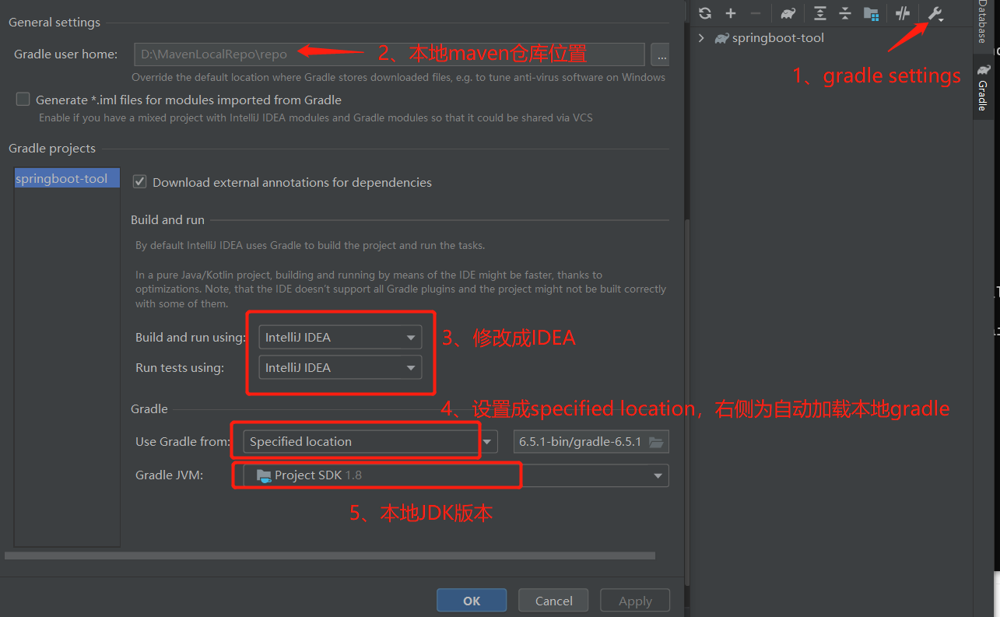

# springboot工具箱，同时是相关工具、插件、原理的学习材料

# 第一部分，gradle项目的创建
## 本地gradle环境配置
1、[gradle下载地址](https://gradle.org/releases/) ，一般选择最新版本的binary包下载即可。
2、随便谷歌百度配置本地gradle。
此处需要说明：
- GRADLE_HOME 参数通常为gradle解压目录
- GRADLE_USER_HOME 通常设为本地maven目录
- 添加init.gradle配置。因为在创建gradle项目的时候，会下载相关依赖，如果不配置初始化所有项目默认maven依赖源，会从gradle中央仓库下载。这时即便自己搭了梯子，速度也会非常慢。配置如下：
在gradle安装目录的init.d文件加下创建init.gradle配置文件，添加如下信息
```aidl
allprojects {
    repositories {
         maven {
             name "aliyunmaven"
             url "http://maven.aliyun.com/nexus/content/groups/public/"
         }
    }
}
```

## 匹配本地JDK版本
修改build.gradle配置文件 ：sourceCompatibility参数为JDK版本

## idea配置

为了避免图片加载错误，翻译一下，idea打开项目，点击右侧gradle图标，点击最左侧扳手按钮，选择gradle settings，进入gradle配置页面：
- gradle user home: 设置为本地maven仓库路径
- build and run using / run tests using：设置成IDEA
- use gradle from：选择specified location(注意此时右侧应该加载出本地gradle路径)
- 配置本地JDK版本

### 等待编译好之后可以运行程序

